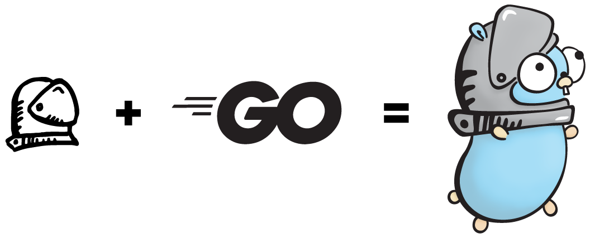

<p align="center">
  
</p>

# Helmet

HTTP security headers middleware for [Go(lang)](https://golang.org/) inspired by [HelmetJS](https://helmetjs.github.io/).

Helmet helps you secure your Golang web applications by setting various HTTP security headers. It's not a silver bullet, but it can help!

## Quick Start

`go get github.com/MagnusFrater/helmet`

```go
package main

import (
	"fmt"
	"log"
	"net/http"

	"github.com/MagnusFrater/helmet"
)

func main() {
	handler := http.HandlerFunc(func(w http.ResponseWriter, r *http.Request) {
		fmt.Fprintln(w, "I love HelmetJS, I just wish there was a Go(lang) equivalent...")
	})

	helmet := helmet.Default()
	http.Handle("/", helmet.Secure(handler))

	log.Fatal(http.ListenAndServe(":8080", nil))
}
```

This code sample can be found in `/examples/01-quick-start`

## How It Works

Helmet is a collection of 12 smaller middleware functions that set HTTP security response headers. Initializing via `helmet.Default()` will not include all of these middleware functions by default.

| Module                                                                                                           | Default                                        |
| ---------------------------------------------------------------------------------------------------------------- | ---------------------------------------------- |
| [Content-Security-Policy](https://developer.mozilla.org/en-US/docs/Web/HTTP/CSP)                                 |                                                |
| [X-Content-Type-Options](https://developer.mozilla.org/en-US/docs/Web/HTTP/Headers/X-Content-Type-Options)       | `nosniff`                                      |
| [X-DNS-Prefetch-Control](https://developer.mozilla.org/en-US/docs/Web/HTTP/Headers/X-DNS-Prefetch-Control)       | `off`                                          |
| [X-Download-Options](https://helmetjs.github.io/docs/ienoopen/)                                                  | `noopen`                                       |
| [Expect-CT](https://developer.mozilla.org/en-US/docs/Web/HTTP/Headers/Expect-CT)                                 |                                                |
| [Feature-Policy](https://developer.mozilla.org/en-US/docs/Web/HTTP/Headers/Feature-Policy)                       |                                                |
| [X-Frame-Options](https://developer.mozilla.org/en-US/docs/Web/HTTP/Headers/X-Frame-Options)                     | `SAMEORIGIN`                                   |
| [X-Permitted-Cross-Domain-Policies](https://helmetjs.github.io/docs/crossdomain/)                                |                                                |
| [X-Powered-By](https://helmetjs.github.io/docs/hide-powered-by/)                                                 | Removes the `X-Powered-By` header              |
| [Referrer-Policy](https://developer.mozilla.org/en-US/docs/Web/HTTP/Headers/Referrer-Policy)                     |                                                |
| [Strict-Transport-Security](https://developer.mozilla.org/en-US/docs/Web/HTTP/Headers/Strict-Transport-Security) | `max-age=5184000; includeSubDomains` (60 days) |
| [X-XSS-Protection](https://developer.mozilla.org/en-US/docs/Web/HTTP/Headers/X-XSS-Protection)                   | `1; mode=block`                                |

You can see more in the [documentation]().

#

Helmet is open source under the [MIT License](https://github.com/MagnusFrater/helmet/blob/master/LICENSE).

Gopher image by [Renee French](https://reneefrench.blogspot.com/), licensed under [CC 3.0 license](https://creativecommons.org/licenses/by/3.0/).

Helmet icon by [Hand-Drawn Goods](https://www.iconfinder.com/handdrawngoods), licensed under [CC 3.0 license](https://creativecommons.org/licenses/by/3.0/).

Gopher + Helmet remix by [Emily Wilson](https://emilywilsondesign.myportfolio.com/), licensed under [CC 3.0 license](https://creativecommons.org/licenses/by/3.0/).
